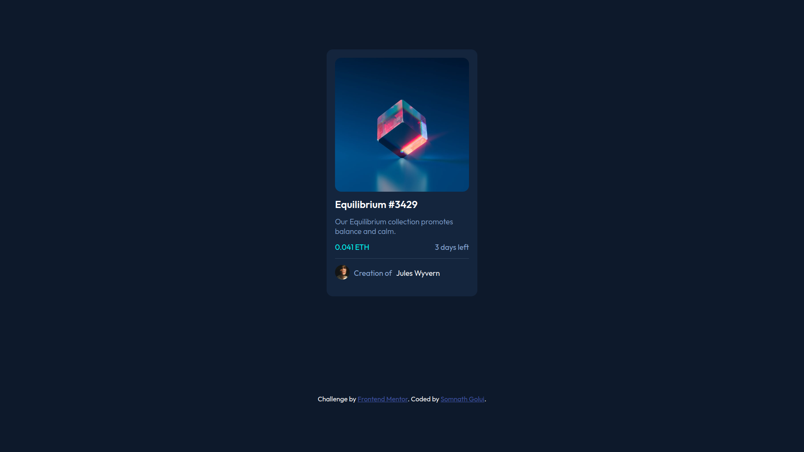
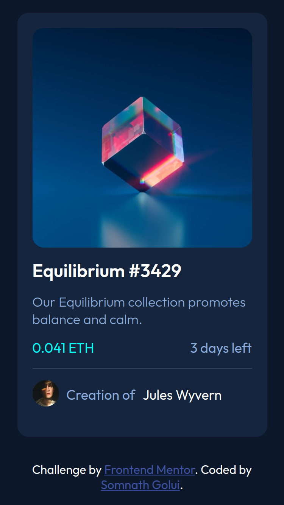

# Frontend Mentor - NFT preview card component solution

This is a solution to the [NFT preview card component challenge on Frontend Mentor](https://www.frontendmentor.io/challenges/nft-preview-card-component-SbdUL_w0U){:target="\_blank" rel="noopener"}. Frontend Mentor challenges help you improve your coding skills by building realistic projects.

## Table of contents

- [Overview](#overview)
  - [The challenge](#the-challenge)
  - [Screenshot](#screenshot)
  - [Links](#links)
  - [Built with](#built-with)
- [Author](#author)

## Overview

NFT preview card component

### The challenge

Users should be able to:

- View the optimal layout depending on their device's screen size
- See hover states for interactive elements

### Screenshot

Desktop View

Mobile View (width 378px)

### Links

- Solution URL: [solution URL here](https://www.frontendmentor.io/solutions/nft-preview-card-component-6xAXzFXpxf){:target="\_blank" rel="noopener"}
- Live Site URL: [live site URL here](https://nft-preview-card-component-5rx.pages.dev/){:target="\_blank" rel="noopener"}

### Built with

- Semantic HTML5 markup
- CSS custom properties
- Flexbox
- CSS Grid

## Author

- Frontend Mentor - [@somu-code](https://www.frontendmentor.io/profile/somu-code){:target="\_blank" rel="noopener"}
- Twitter - [@GoluiSomnath](https://www.twitter.com/GoluiSomnath){:target="\_blank" rel="noopener"}
